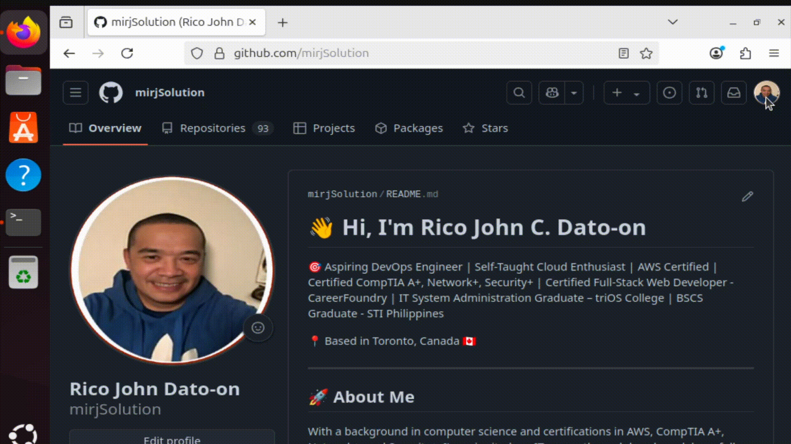
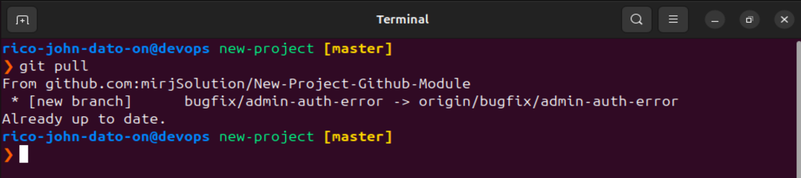
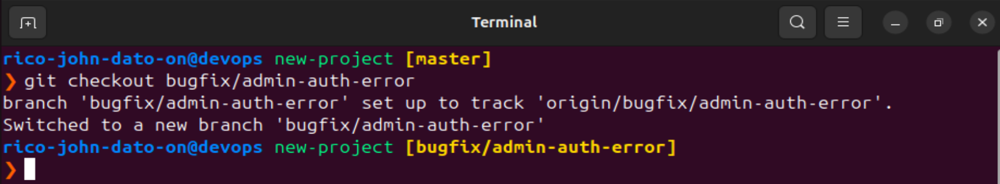
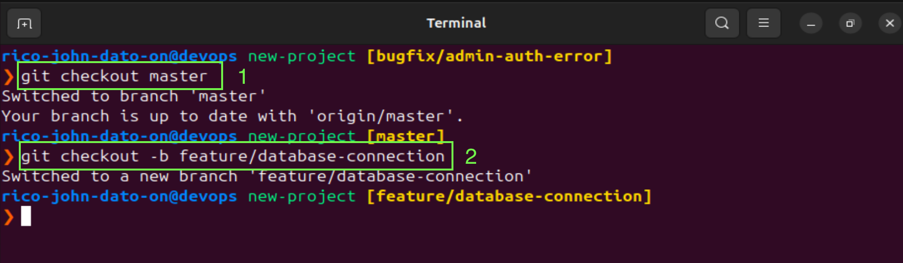
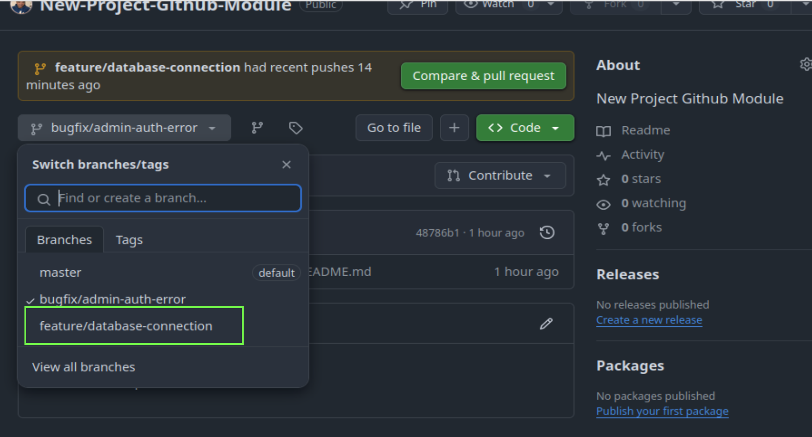

# 🌿 Git Branching Strategy for DevOps

Version control is at the heart of modern software development. Branching in Git allows developers to manage features, fixes, and production-ready code efficiently and in parallel.

---

## 🧠 What Are Git Branches?

A **branch** in Git is essentially a pointer to a snapshot of your changes. The default branch is typically called `master` or `main`.

Branches allow developers to:

- Safely develop features or fixes in isolation.
- Prevent disrupting the main codebase.
- Collaborate through pull requests and code reviews.

---

## 🛠️ Common Branch Naming Convention

- `feature/login-auth` – Adds a login authentication feature.
- `bugfix/null-pointer` – Fixes a specific bug.
- `hotfix/memory-leak` – Critical patch for production.
- `release/v1.0.0` – Marks a production release.

---

## 🔀 Best Practice: One Feature or Fix = One Branch

Each task or ticket should be handled in a dedicated branch to ensure clarity and traceability. This minimizes merge conflicts and improves team workflow.

---

## 📍 Remote and Local Branch Setup

### 🔧 Create & New Branch UI

To create a new branch on GitHub, navigate to your repository, click the branch dropdown, type your desired branch name, and then select the "Create branch" option.



To apply the branch on your local machine

```bash
git pull
```



### 🔧 Switch to a New Branch Locally

```bash
git checkout  <branch name/tag name>
```



### 🔧 Create and Switch to a New Branch Locally

```bash
git checkout <branch name>
git checkout -b <branch name/tag name>
```



### 🚀 Push Branch to Remote

To reflect a locally created branch on the remote repository, you must push it.

Here in my sample i will update the README.md file then push it to my repo.


```bash
vim README.md
# you can type anything you want on the readme and update it.
git add README.md
git commit -m 'Update README.md File'
git push --set-upstream origin feature/database-connection
```

Refresh your GitHub page to see the newly pushed branch.



---

## 🤝 Develop Branch (Optional)

Some teams use a `develop` branch as an intermediate integration branch before pushing to `master`. But in CI/CD workflows:

> 💡 It's best to deploy directly from `master`.

---

## 📘 Summary

| Branch Type | Purpose                     |
| ----------- | --------------------------- |
| `master`    | Production-ready code       |
| `develop`   | Optional staging branch     |
| `feature/*` | New feature development     |
| `bugfix/*`  | Fixing non-critical bugs    |
| `hotfix/*`  | Urgent fix on production    |
| `release/*` | Preparing for a new release |

---

> Keep your Git history clean. Branch smart. Merge responsibly.

🧑‍💻 _Created by Rico John Dato-on_
🔗 [LinkedIn](https://www.linkedin.com/in/rico-john-dato-on) • [Portfolio](https://ricodatoon.netlify.app)

---
